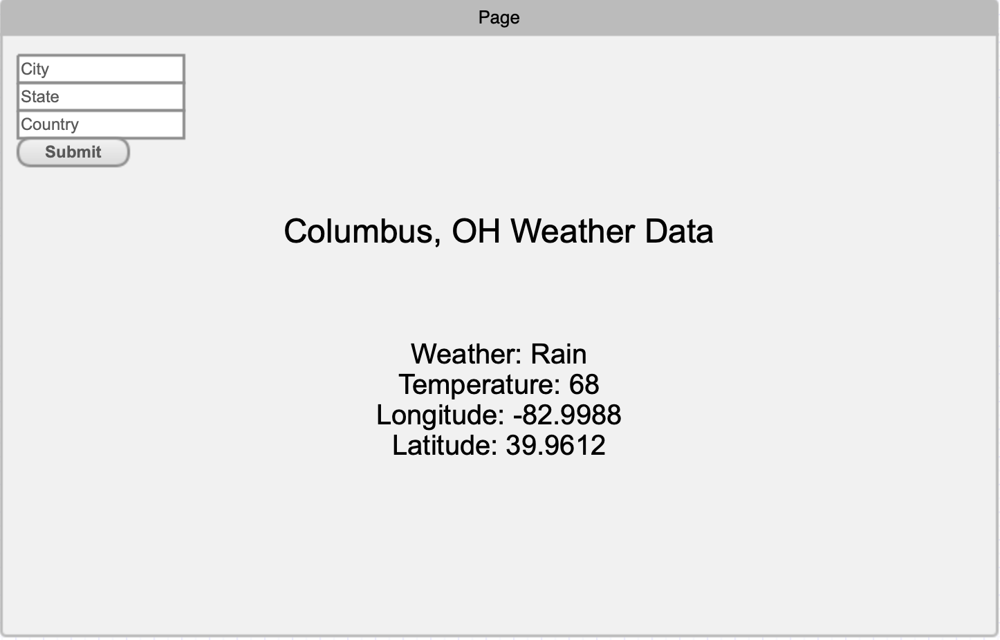

# simple-weather-app

## Requirements
* JDK 21
* IntelliJ (for backend)
* VSCode (recommended for frontend)
* Postman
* Node version 18 or newer

## API
* https://openweathermap.org/current
* Need to make an account and get your `API Key` to access the API
* Paste the `API Key` in the backend's [`application.yml`](backend/src/main/resources/application.yml) file

## Overview
* [Java Spring Boot Backend](backend/)
  - Receives request from the frontend
  - Sends request to the API
  - Parses the JSON response from the API
  - Sends data back to frontend

* [React Frontend (Vite)](frontend/)
  - (For first time only) install Vite by executing `npm install vite` command
  - Shows weather data for `Columbus, OH, USA` by default
  - Should have a textfield for a city, state, and country and a button to send data to the backend
  - Displays the new weather data based on the response from the backend
  - Run the web server by executing `npm run dev` command from the directory with `package.json` (in this case, `frontend/` directory)

## Ports
* Frontend: `3000`
* Backend: `8080`

## What you'll make (Mock-up)

## Changelog
* Sep 22, 2024:
  - Changed frontend framework from Create React App to Vite (CRA is no longer supported or updated)
  - Changed backend to use JDK 21
  - Updated backend's module path and it's pom.xml